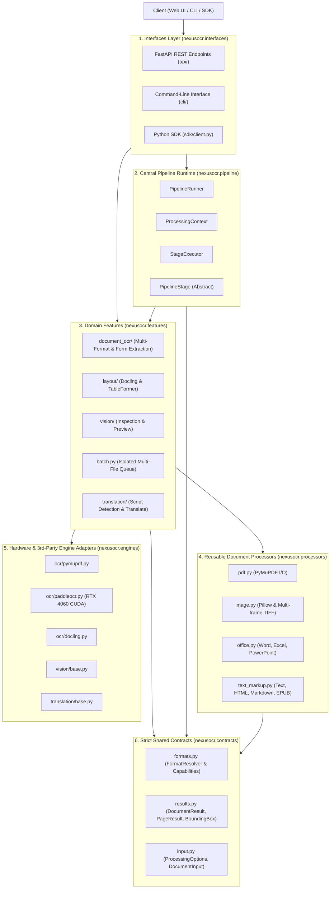

# NexusOCR Architectural Documentation & Engineering Report

Welcome to the comprehensive technical documentation for the **NexusOCR** document intelligence platform. This directory provides an architectural breakdown, execution flow traces, and forward-looking engineering guidelines.

---

## 📚 Document Index

1. **[Architecture & System Design](ARCHITECTURE.md)**
   * High-level architectural pattern (Hybrid Feature-Oriented Pipeline).
   * Layer breakdown: `pipeline/`, `features/`, `engines/`, `processors/`, `contracts/`, and `interfaces/`.
   * Complete component topology and dependency boundaries.
   * Backward compatibility architecture (legacy shims & bridges).

2. **[Code Flow & Execution Tracing](CODE_FLOW.md)**
   * Complete end-to-end request lifecycles (REST API, CLI, Python SDK).
   * 2-Tier Adaptive Document Routing mechanism (PyMuPDF Tier 1 vs PaddleOCR Tier 2 GPU).
   * Central pipeline execution lifecycle (`ProcessingContext` & `PipelineStage`).
   * Multimodal workflows (PDF, Image, Video, Audio, Translation, Layout).
   * Sequence diagrams illustrating runtime interactions.

3. **[Developer Guidelines & Future Roadmap](DEVELOPER_GUIDELINES.md)**
   * Architectural invariants and golden rules.
   * Step-by-step guide: Adding a new pipeline stage.
   * Step-by-step guide: Integrating a new engine adapter (e.g., VLM / Qwen2.5-VL).
   * Step-by-step guide: Adding a new media processor or feature service.
   * Python 3.10.11 compatibility guardrails.
   * Testing, logging, and error-handling standards.

---

## 🏛️ Quick Architecture Overview

---

## 🔍 Core Design Principles

1. **Strict Separation of Execution Mechanics vs Domain Decisions**:
   - `pipeline/` manages *how* stages execute (timing, cancellation, progress, errors).
   - `features/` manages *what* business logic is performed (trust scoring, tier selection, translation).
2. **Hardware & Provider Isolation**:
   - Heavy dependencies (PaddleOCR, CUDA, Docling, PyMuPDF) live strictly inside `engines/`.
   - The rest of the codebase interacts via abstract base classes and typed contracts.
3. **Zero Breaking Changes via Non-Intrusive Bridges**:
   - The project preserves all legacy import paths (`from pipeline import NexusOCRPipeline`, `from engine.types import ...`, `import config`, `from app import app`) through lightweight compatibility shims.
4. **Deterministic Python 3.10.11 Compatibility**:
   - Verified via AST parsing to prevent any Python 3.11+ syntax or standard library leakage.
